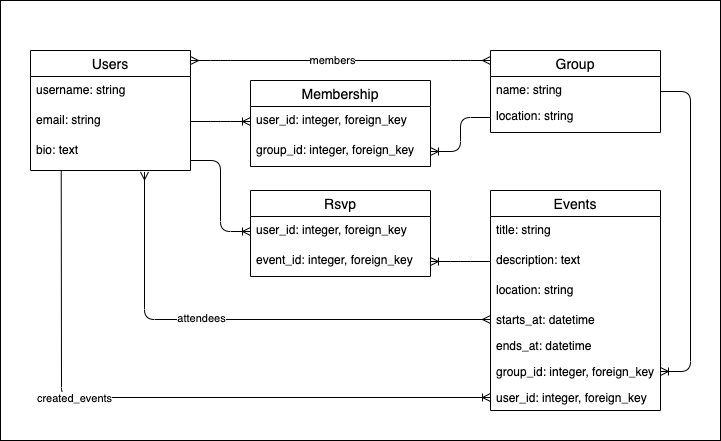

# Phase 4 - Lesson 1 - Rails Fundamentals

In this phase we will be building on our knowledge of Ruby and ActiveRecord from Phase 3 to:
- build RESTful APIs with Ruby on Rails
- validate data and return responses with appropriate status codes so that we can give our users more meaningful feedback in API responses
- build applications that include user authentication and access control. 
- deploy our applications so we can share them with friends, family and potential employers

For the application we'll be building together, we'll be working on a meetup clone. We'll again be adding new features every day, but this time, you'll be working on the app on your own machine day by day. So, you'll want to be keeping up with the work for each day so you'll be ready to participate during the exercise the following day.

## Today's Goals

- Explain convention over configuration and why it’s important in Rails
- Describe the MVC design pattern
- Create routes in Rails
- Identify the differences between Sinatra and Rails
- Scaffold an API using rails generators

## A note about coding along

While coding along can be a good way to practice, if you ever feel like you're having trouble coding along AND following along with the conversation we're having during the lecture, I'd recommend focusing on understanding and participating in the conversation. During this phase, I won't be doing any coding on the rails code in between lectures, so if you want to have your own version of the app on your machine that you work on independently, you can use the GitHub diffs that I'll share with you all to view the changes we made to the code during a particular lecture.

## What things are different with Rails than they were in Sinatra

- 

## Lesson 1 Todos

### Instructions for Demo

#### 1. Create a new rails application for our reading list application. 
`rails new meetup_clone_api --api --minimal --skip-javascript -T`

Note: Do not forget the --api! The rails application will not be configured correctly if you do! If you forget it, delete the application and re-create it. 
#### 2. Configure cors by uncommenting the `gem 'rack-cors'` and going to `config/initializers/cors.rb` and uncommenting the code below (make sure to replace `'example.com'` with `*` within origins):

```rb 
Rails.application.config.middleware.insert_before 0, Rack::Cors do
   allow do
     origins '*'

     resource '*',
       headers: :any,
       methods: [:get, :post, :put, :patch, :delete, :options, :head]
   end
 end
```
<details>
  <summary>
    When is CORS necessary? What is it for?
  </summary>
  <hr/>

  Short for Cross Origin Resource Sharing, we need to use CORS when we intend to deploy our rails API application to a separate domain from the React client that will consume its data. If we deploy the API and client to the same domain, CORS will not be necessary to receive the data, because the fetch requests will be coming from the same origin.

  <hr/>

</details>
<br/>


#### 3. Create the following migrations for meetup_clone

Note: you do not need to write the tables yourself. There is a way to automatically generate the table with the corresponding columns using rails generators

<details>
  <summary>
    Which resources would you start with here? Why?
  </summary>
  <hr/>

  While there's not really a right answer to this question, it can't hurt to get into a habit and stick to it!
  
  I prefer to start with the parent resources (ones that have child resources that belong to them) as this is the order in which we'll have to create the objects in seed data. Because AR objects that belong to other objects must be created after their parent objects have been saved, I prefer to create the class for the parent object first as well. 

  Both will technically work, but if you create the child resource that belongs to the parent before creating the parent, you'll be unable to save instances of the child until you've created the parent as well.

  <hr/>

</details>
<br/>


<details>
  <summary>
    How do we create a migration for a table that will have foreign key columns to support a belongs_to relationship?
  </summary>
  <hr/>

  We can use the `belongs_to` option when we generate the resource to generate the following:
  - a foreign_key matching the argument
  - an index on the column
  - a null false constraint on the column (to ensure that it has a value)
  - the belongs_to macro added to the model.

```bash
rails g resource UserEvent user:belongs_to event:belongs_to
```

Will generate the following migration:

```rb
class CreateUserEvents < ActiveRecord::Migration[6.1]
  def change
    create_table :user_events do |t|
      t.belongs_to :user, null: false, foreign_key: true
      t.belongs_to :event, null: false, foreign_key: true

      t.timestamps
    end
  end
end
```

and the following model:

```rb
class UserEvent < ApplicationRecord
  belongs_to :user
  belongs_to :event
end
```
  <hr/>

</details>
<br/>

#### 4. Go to Models and add the association macros to establish the relationships pictured in the Entity Relationship Diagram (ERD). 
<details>
  <summary>
    What does adding `belongs_to` or `has_many` to a model actually do?
  </summary>
  <hr/>

  - **Defines methods** that handle specific tasks related to associations 
    - Creating an associated object (@post.comments.create)
    - Retrieving all associated objects (@post.comments)
    - finding an associated object (@post.comments.find)
  - Uses convention over configuration to set up SQL queries to support the tasks above. 
    - Key assumptions if a `Post` `has_many :comments`:
      - there is a class called `Comment` (and its associated table is called `comments`)
      - the `comments` table has a foreign key called `post_id`
      - the `posts` table has a primary key called `id`
    - 

  <hr/>

</details>
<br/>

#### 5. In the rails console OR in seeds create seeds for users and groups and test your relationships.
 (You'll want to create groups that are related to users and events that are related to groups, try checking out the [has_many](https://apidock.com/rails/ActiveRecord/Associations/ClassMethods/has_many) docs for examples)

 <details>
  <summary>
    Seeds
  </summary>
  <hr/>

  ```rb
user = User.create(username: 'Dakota', email: 'dakota@dakota.com', bio: 'i love ruby')
user2 = User.create(username: 'Dex', email: 'dex@dex.com', bio: 'i love js')

group = Group.create(name: 'SENG-083021', location: 'everywhere!')

event = user.created_events.create(
  group: group,
  title: 'Rails Fundamentals',
  description: 'migrations generators and fun!',
  start_time: Time.new(2021, 11, 1, 11),
  end_time: Time.new(2021, 11, 1, 13)
)

event.attendees = [user, user2]
```

  <hr/>

</details>
<br/>


#### 6. In `config/routes.rb` Add an index and show route for groups
We'll also want to comment out the resources that have been added so we can ensure we only have routes for the controller actions we've actually built out. 
#### 7. In the groups controller add an index action that renders all of the groups in json. Make a show action that renders 1 group's information given the id
#### 8. Run your rails server and go to the browser (or use postman) to check that your json is being rendered for both routes

