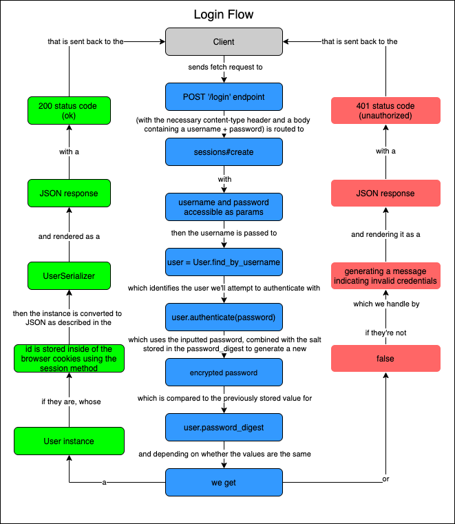
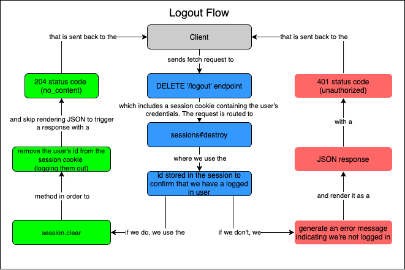

# Phase 4 - Lecture 5: Rails Authentication

- We'll be adding auth to the Meetup clone today. The react client has been updated, if you're coding along and want to run it alongside the backend as we update it, pull down the [meetup clone client repo](https://github.com/DakotaLMartinez/042522_meetup_clone_client). 
- Key Authentication Concepts for the day:
    - Sessions
    - Cookies
    - Password Security

## Sessions, Cookies and the Hotel Keycard analogy


| Hotel                  | Web App                   | Concept               |
| :--------------------- | :------------------------ | :-------------------- |
| Book a reservation     | signup for an account     | Registration          |
| Check in at front desk | Login to an account       | Authentication        |
| ID & Credit Card       | Email/Username & Password | Credentials           |
| Keycard                | Cookie                    | User session tracking |
| Card reader            | Session                   | User session tracking |

## Endpoints
These are the 4 endpoints we'll need to add to support authentication in our applications.
| Endpoint | Purpose | params |
|---|---|---|
| get '/me' | returns the currently logged in user or 401 unauthorized if none exists. Used to determine whether to load the `AuthenticatedApp` or `UnauthenticatedApp` | none |
| post '/login' | returns the newly logged in user | username and password |
| post '/signup' | returns the newly created (and logged in) user | username, password, and password_confirmation |
| delete '/logout' | removes the user_id from the session cookie | none |
## Checking for authentication with `GET '/me'`


- We'll be using this endpoint from the frontend to determine when the user is logged in and when they're not
  - If we get an OK response, we have a logged in user
  - If we don't, that means we don't have a currently logged in user.
## Logging in with `POST '/login'`



- This endpoint will be used to handle a login form submission from the client application.
  - If we get an OK response, the user's id is stored in the encrypted session cookie, logging them in and allowing access to the logged in version of the react application with that user's data. In React, we'll store the user we get back from logging in within the currentUser piece of state.
  - If we don't, we'll be able to tell the user that they presented invalid credentials in the form.
## Signing Up with `POST '/signup'`


- This endpoint will be used to handle the signup form submission from the client application.
  - If we get an OK response, the newly registered user'd id will be stored in the encrypted session cookie, logging them in and allowing access to the logged in version of the react application with that user's data. In React, we'll store the user we get back from signing up within the currentUser piece of state.
  - If we don't, we'll be able to display validation errors to the user and allow them to submit the form again.
## Logging Out with `DELETE '/logout'`



- This endpoint will be used to handle clicking on the logout button from the client application.
  - If we get an OK response, the user's id will be removed from the session cookie, logging them out and sending them back to the logged out version of the react application. In React, we'll set the currentUser to `null` so we get the logged out experience.
  - The only reason we wouldn't get an OK response is if we sent this request and we weren't already logged in. We can add error handling here, but we shouldn't actually need it.

## React Support for Authentication


- The basic strategy here is to have two different top level components.
  - One for logged in users 
  - and one for non-logged in users.
- We'll render nothing until we've checked for a logged in user.
- Then we'll check to see that someone is logged in 
  - If we have a logged in user (based on the contents of our session cookies) we'll show the logged-in version of the app
  - If we don't, we'll show a non-logged in version of the app (in our case we'll just have routes for signing up and logging in, but you could also have a landing page route, for example)

# Plan of Attack

- Authentication in a web application involves a set of related features
- Split tasks into foundational layers (working backwards)
  - dependencies
  - configuration
  - model 
  - database
- After foundation is laid, we'll fill in the routes and controller actions needed to handle the 4 requests mentioned above.
## Dependencies (Gems/packages)
<details>
  <summary>
    What dependencies do we need to add to support authentication?
  </summary>
  <hr/>

  We need bcrypt so that we can store encrypted (salted and hashed) versions of our users passwords instead of storing passwords in plain text:

  ```bash
  bundle add bcrypt
  ```

  <hr/>

</details>
<br/>


## Configuration (environment variables/other stuff in config folder)
<details>
  <summary>
    What configuration do we need to add to support authentication?
  </summary>
  <hr/>

  We need to tell rails that we want session cookies. To do that, we'll add the following to the config block in `config/application.rb`
  ```rb
  config.middleware.use ActionDispatch::Cookies
  config.middleware.use ActionDispatch::Session::CookieStore

  # Use SameSite=Strict for all cookies to help protect against CSRF
  config.action_dispatch.cookies_same_site_protection = :strict
  ```
  We'll also need to include the middleware within the `ApplicationController`

  ```rb
  class ApplicationController < ActionController::API
    include ActionController::Cookies
    # ...
  end

  ```

  <hr/>

</details>
<br/>


## Database

<details>
  <summary>
    What database changes do we need to make to support authentication?
  </summary>
  <hr/>

  We need a `password_digest` column in our `users` table to store our users' encrypted passwords.

  ```bash
  rails g migration AddPasswordDigestToUsers password_digest
  ```

  ```bash
  rails db:migrate
  ```

  <hr/>

</details>
<br/>


## Models
<details>
  <summary>
    What changes in the model layer do we need to add to support authentication?
  </summary>
  <hr/>

  - We need to add the `has_secure_password` macro to the User model to implement the `password=`, `password_confirmation=` and `authenticate`  methods used in signup & login actions respectively
  - We need to add a uniqueness validation for username (and email) So we can consistently find the right user for authentication

  <hr/>

</details>
<br/>

## Views/Serializers
<details>
  <summary>
    What do we need to change in our serializers to support authentication?
  </summary>
  <hr/>

  - We'll want a `UserSerializer` that returns only the `id`, `username`, `email`, and `bio`

  <hr/>

</details>
<br/>


## Routes

<details>
  <summary>
    What routes do we need to add to support authentication?
  </summary>
  <hr/>

  ```rb
  get "/me", to: "users#show"
  post "/signup", to: "users#create"
  post "/login", to: "sessions#create"
  delete "/logout", to: "sessions#destroy"
  ```

  <hr/>

</details>
<br/>


## Controllers

<details>
  <summary>
    What changes or additions do we need to affect in our controllers to support authentication?
  </summary>
  <hr/>

  We'll need to:
  - change the `current_user` method so that it makes use of the `user_id` stored in the session cookie sent from the browser. This will allow us to login as different users and have our application recognize user's requests by reading the `user_id` out of the cookie and returning the user whose id matches.

  We'll need actions for:
  - `users#show` - for rendering the currently logged in user as json
  - `users#create` - for handling the signup form submission and rendering the newly created user as json (while logging them in)
  - `sessions#create` - for handling the login form submission and rendering the newly logged in user as json
  - `sessions#destroy` - for handling logout and removing the user_id from the session cookie

  <hr/>

</details>
<br/>


