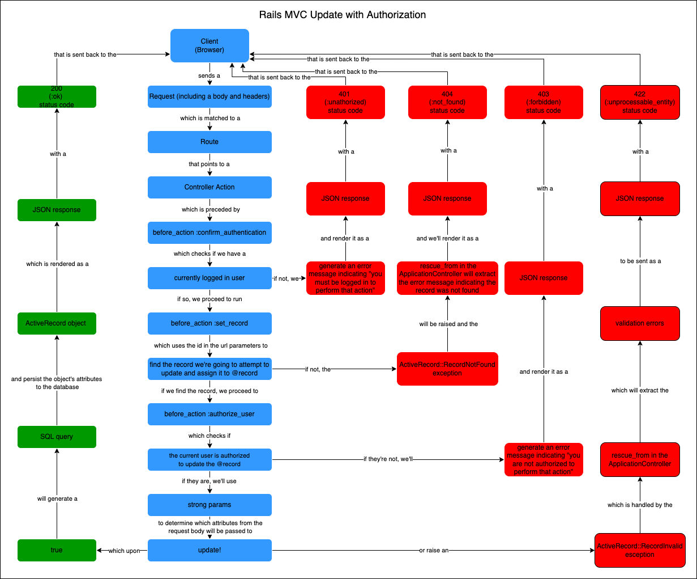

# Phase 4 - Lecture 6: Rails Authorization

Today's key concepts:
- Access Control
- `before_action` macro for condensing controller logic

## Meetup Clone Features

- Users can be admins
- Events can only be updated and deleted by an admin or their creator

## Adding Admin Functionality

```bash
rails g migration AddAdminToUsers admin:boolean
```

Generates a migration that looks like this

```rb
class AddAdminToUsers < ActiveRecord::Migration[6.1]
  def change
    add_column :users, :admin, :boolean
  end
end
```

Which we can then run:

```bash
rails db:migrate
```
And then in a `rails console` we can create a new admin user or update the first user to be an admin:

```rb
User.create(username: 'admin', password: 'password', email: 'admin@test.com', admin: true)
# or
User.first.update(admin: true)
```

We're not going to update our strong parameters in the `UsersController` so users won't be able to set themselves as an admin through the API, it can only be done via the console or a SQL query currently.

## Adding Authorization

- Authentication has been added
- access control has not
- `current_user` returns whoever is logged in–if we have a logged in user. But our controller actions are calling the `current_user` method assuming that it returns a user even if nobody is currently logged in.
- test out the `get /groups` endpoint in postman to demonstrate the problem.

<details>
  <summary>
    How do we fix this?
  </summary>
  <hr/>

  ```rb
  def confirm_authentication
    render json: { errors: "You must be logged in to do that." }, status: :unauthorized unless current_user
  end
  ```

  <hr/>

</details>
<br/>

### 2 ways to use the before_action:
- add to application_controller so it defaults to applying to every api call.
    - we then have to add a skip_before_action to individual controllers/actions if we don't want this check
- add it to individual controllers.
    - we then have to add it in a bunch more places and we need to remember to add it if we need it.

#### Say we choose the first approach, where do we need to add `skip_before_action :confirm_authentication`? ... Why?

<hr/>

### Pause to Contemplate
<hr/>

## Authentication vs Authorization

In our first step, we've checked that we have a properly authenticated user before providing access to a protected route/resource. The status code we're using for this is a 401 unauthorized. 

There is actually another status code called 403 forbidden that is used to signify an authorization failure. 

| Failure | Meaning |
|---|---|
| Authentication Failure (401)| No credentials present (forgot your keycard) |
| Authorization Failure (403)| Credentials are present but don't provide access (using your keycard for the wrong room or to access an employees only area) |

Up until this point, this is how our destroy actions look in our controllers:

```rb
def destroy
  event = Event.find(params[:id])
  event.destroy
end
```

Currently, this will allow any logged in user to delete an event (provided they send a request with its id as the url parameter). What we want, however, is to allow only an admin user or the creator of an event to update or delete that event.

In this section, we'll use our newly built `admin` functionality to authorize certain endpoints and allow admin users access to modify or delete other users' events without granting that access to everyone. We could apply this functionality to our other controllers as well, but in the interest of time, we're going to focus on the `EventsController` today.

Before we do this, I'm going to demonstrate a pattern you'll see a lot in rails controllers. We define a private method that runs before the `show`, `update` and `destroy` actions and finds the appropriate ActiveRecord model object.

```rb
class EventsController < ApplicationController
  before_action :set_event, only: [:show, :update, :destroy]
  # ...
  private 
  
  def set_event
    @event = Event.find(params[:id])
  end
end
```

This will allow us to remove or replace some logic in our individual controller actions (`show`, `update`, and `destroy`) that fetch an event from the database using its id. We'll also need to make sure we replace `event` with `@event`. Next, we'll add another private method for authorization.

```rb
def authorize_user
  user_can_modify = current_user.admin? || @event.user_id == current_user.id
  render json: { error: "You don't have permission to perform that action" }, status: :forbidden unless user_can_modify
end
```

This method is only necessary before the `update` and `destroy` actions because `show` is non destructive and should be accessible to all logged in users. 

So, now that we have the private method, we'll need to add the `before_action` so it is invoked before `update` and `destroy`

```rb
before_action :set_event, only: [:show, :update, :destroy]
before_action :authorize_user, only: [:update, :destroy]
```

>NOTE the before_actions run in order, so we can access `@event` within `authorize_user` only if we add the `before_action :authorize_user` **below** `before_action :set_event`



We'll have something like this when we're finished:

```rb
class EventsController < ApplicationController
  before_action :set_event, only: [:show, :update, :destroy]
  before_action :authorize_user, only: [:update, :destroy]
  
  def index
    events = Event.all.includes(:user_events)
    render json: events
  end

  def show
    render json: @event, serializer: EventDetailSerializer
  end

  def create
    event = current_user.created_events.new(event_params)
    if event.save
      render json: event, status: :created
    else
      render json: event.errors, status: :unprocessable_entity
    end
  end

  def update
    if @event.update(event_params)
      render json: @event, status: :ok
    else
      render json: @event.errors, status: :unprocessable_entity
    end
  end

  def destroy
    @event.destroy
  end

  private

  def event_params
    params.permit(:title, :description, :location, :start_time, :end_time, :group_name, :cover_image_url)
  end

  def set_event
    @event = Event.find(params[:id])
  end

  def authorize_user
    user_can_modify = current_user.admin? || @event.user_id == current_user.id
    render json: { error: "You don't have permission to perform that action" }, status: :forbidden unless user_can_modify
  end

end
```

### Telling our React App when to display Edit/Delete Buttons

Now that we have our backend configured only to allow authorized users to update or delete events, we can go one step further to make sure that we only show the edit and delete buttons to users who actually have permission to update or delete that event.

For this, we'll want to update the `EventSerializer` to include a new attribute called `user_can_modify` which will return a boolean indicating to our React client whether or not we should display edit and delete buttons for that event.

To test it out, we can create an event belonging to the first user in the console:

```rb
User.first.created_events.create(title: 'testing', description: 'admin should be able to delete this', start_time: '2021-09-29 12:00:00', end_time: '2021-09-29 13:00:00', location: 'zoom', group: Group.last)
```
Now, boot up the servers, log in as the first user (that we made an admin in the console) using the credentials: 
```
username: 'Dakota'
password: 'password'
```
Go to the events list and you should now have the option to cancel the event.


